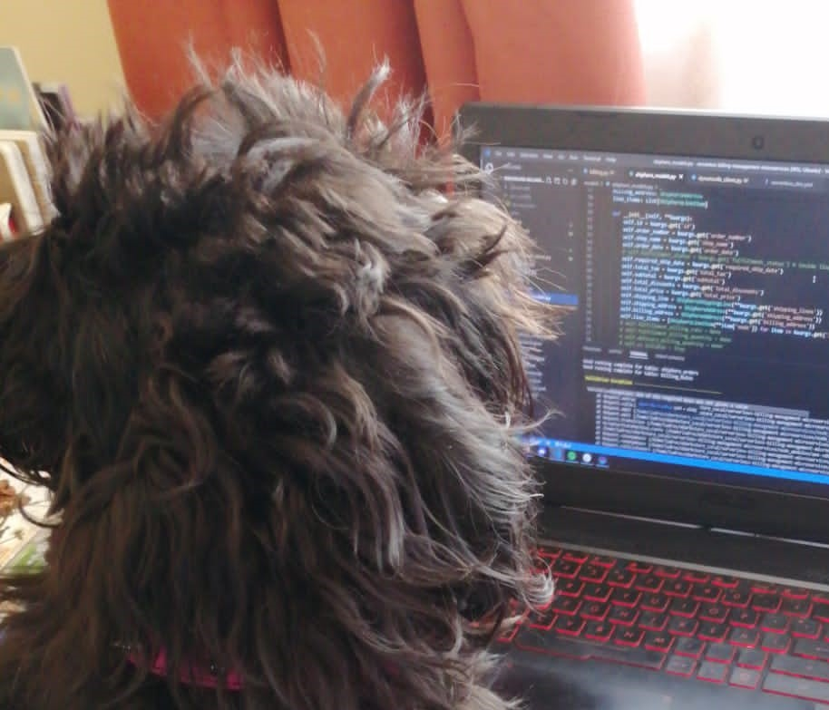

# Consultora Java

Integrantes Proyecto:
  - Nicolás Sepúlveda
  - Paulina Candia
  - Maickol Reyes

# Mis Equipos NEO

Actualmente la Unidad de Neonatología del Hospital Frike se encuentra con problemas de inventariado de equipos, los cuales poseen un desorden con estos mismos, por lo cual, como consultora, hemos decidido realizar un software web que permite un orden y registro de todos los equipos de manera más ordenada, trabajando con un inventario.

Este inventario consta de 2 interfaces, una para la Coordinadora a cargo y otro para las Matronas, las cuales poseen funciones distintas.

Estas funciones las definimos en los [Requerimientos](./documents/Requerimientos.md).

También, se elaboró un [Diagrama](./img/Diagrama%20Casos%20de%20Uso.png) enfocando estos puntos definidos.

Además, se crearon una serie de [bocetos](./Bocetos) con los cuales funcionaria la página.

Adiconalmente se confeccionó un [Modelo Entidad Relación]()

Y finalmente, un [listado de supuestos](./documents/Supuestos.md) que consideraremos para estos puntos definidos.